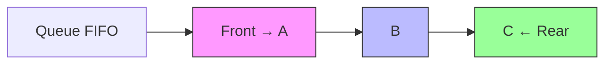
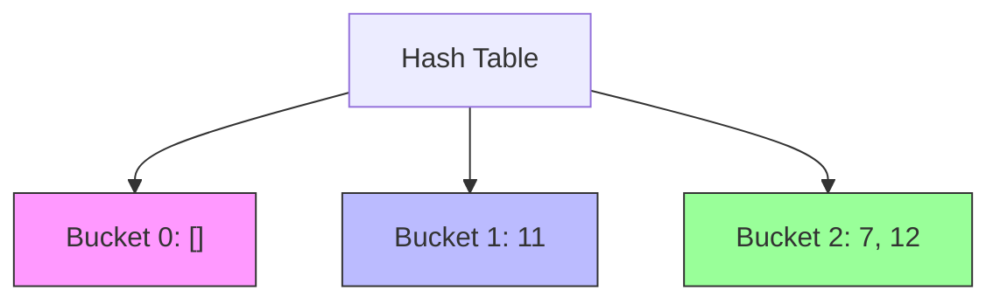
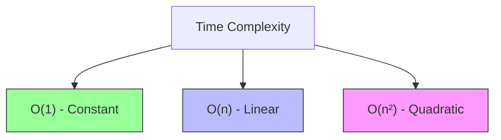
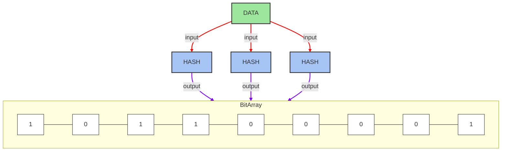

```mermaid
flowchart TD
    A[Start Operation] --> B{Type?}
    B -->|Insert| C{Position?}
    B -->|Delete| D{Key or Position?}
    
    %% Insertion Logic
    C -->|Head| E[Create New Node]
    E --> F[Set next = current head]
    F --> G[Update Head Pointer]
    G --> H[End: O(1)]
    
    C -->|Tail| I[Traverse to tail: O(n)]
    I --> J[Set tail.next = New Node]
    J --> K[Update Tail Pointer]
    K --> H
    
    C -->|Middle| L[Traverse to position: O(n)]
    L --> M[Set new.next = current.next]
    M --> N[Set current.next = new]
    N --> H
    
    %% Deletion Logic
    D -->|Key| O[Traverse until key match: O(n)]
    O --> P{Found?}
    P -->|Yes| Q[Set prev.next = current.next]
    P -->|No| R[Throw KeyError]
    Q --> S[Free memory]
    S --> H
    
    D -->|Position| T[Traverse to position: O(n)]
    T --> U{Valid?}
    U -->|Yes| V[Set prev.next = current.next]
    U -->|No| W[Throw IndexError]
    V --> S
    
    %% Common Paths
    H --> Z[Update Size Counter]
    Z --> Y[Return Status]
    
    style H stroke:#4CAF50,stroke-width:2px
    style R,W stroke:#FF5722
    style G,K stroke:#2196F3
```
