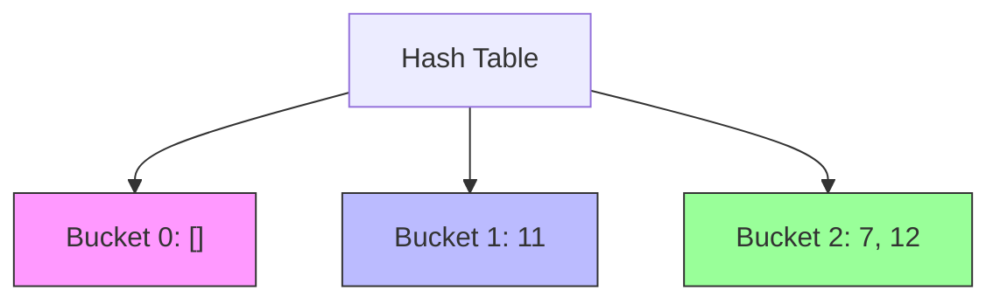

```mermaid
graph LR
    A[Queue FIFO] --> B["Front → A"]
    B --> C["B"]
    C --> D["C ← Rear"]
    style B fill:#f9f,stroke:#333
    style C fill:#bbf,stroke:#333
    style D fill:#9f9,stroke:#333
```

```mermaid
graph TD
    A[Hash Table] --> B["Bucket 0: []"]
    A --> C["Bucket 1: 11"]
    A --> D["Bucket 2: 7, 12"]
    style B fill:#f9f,stroke:#333
    style C fill:#bbf,stroke:#333
    style D fill:#9f9,stroke:#333
```
