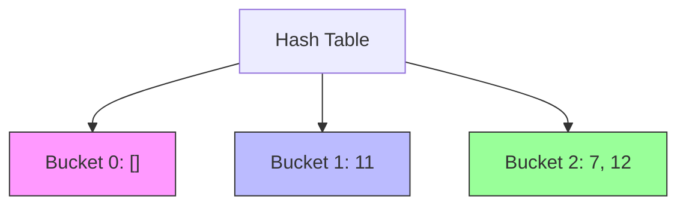
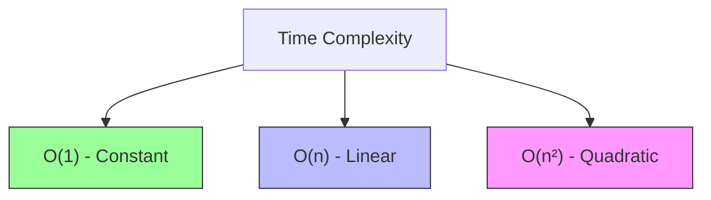
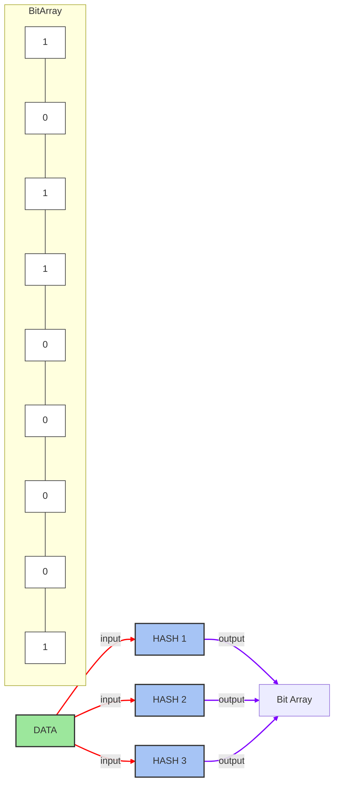

```mermaid
graph LR
    A[Queue FIFO] --> B["Front → A"]
    B --> C["B"]
    C --> D["C ← Rear"]
    style B fill:#f9f,stroke:#333
    style C fill:#bbf,stroke:#333
    style D fill:#9f9,stroke:#333
```

```mermaid
graph TD
    A[Hash Table] --> B["Bucket 0: []"]
    A --> C["Bucket 1: 11"]
    A --> D["Bucket 2: 7, 12"]
    style B fill:#f9f,stroke:#333
    style C fill:#bbf,stroke:#333
    style D fill:#9f9,stroke:#333
```

```mermaid
graph TD
    A[Time Complexity] --> B["O(1) - Constant"]
    A --> C["O(n) - Linear"]
    A --> D["O(n²) - Quadratic"]
    style B fill:#9f9,stroke:#333
    style C fill:#bbf,stroke:#333
    style D fill:#f9f,stroke:#333
```

```mermaid
graph LR
    A[DATA] -->|input| B[HASH 1]
    A -->|input| C[HASH 2]
    A -->|input| D[HASH 3]
    
    B -->|output| E[Bit Array]
    C -->|output| E
    D -->|output| E
    
    subgraph BitArray
        E1[1] --- E2[0] --- E3[1] --- E4[1] --- E5[0] --- E6[0] --- E7[0] --- E8[0] --- E9[1]
    end
    
    style A fill:#9ce79c,stroke:#333,stroke-width:2px
    style B fill:#a6c4f5,stroke:#333,stroke-width:2px
    style C fill:#a6c4f5,stroke:#333,stroke-width:2px
    style D fill:#a6c4f5,stroke:#333,stroke-width:2px
    style E1 fill:white,stroke:#333,stroke-width:1px
    style E2 fill:white,stroke:#333,stroke-width:1px
    style E3 fill:white,stroke:#333,stroke-width:1px
    style E4 fill:white,stroke:#333,stroke-width:1px
    style E5 fill:white,stroke:#333,stroke-width:1px
    style E6 fill:white,stroke:#333,stroke-width:1px
    style E7 fill:white,stroke:#333,stroke-width:1px
    style E8 fill:white,stroke:#333,stroke-width:1px
    style E9 fill:white,stroke:#333,stroke-width:1px
    
    classDef arrow stroke:#ff0000,stroke-width:2px
    classDef outputArrow stroke:#7f00ff,stroke-width:2px
    
    linkStyle 0 stroke:#ff0000,stroke-width:2px
    linkStyle 1 stroke:#ff0000,stroke-width:2px
    linkStyle 2 stroke:#ff0000,stroke-width:2px
    linkStyle 3 stroke:#7f00ff,stroke-width:2px
    linkStyle 4 stroke:#7f00ff,stroke-width:2px
    linkStyle 5 stroke:#7f00ff,stroke-width:2px
```
