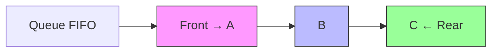
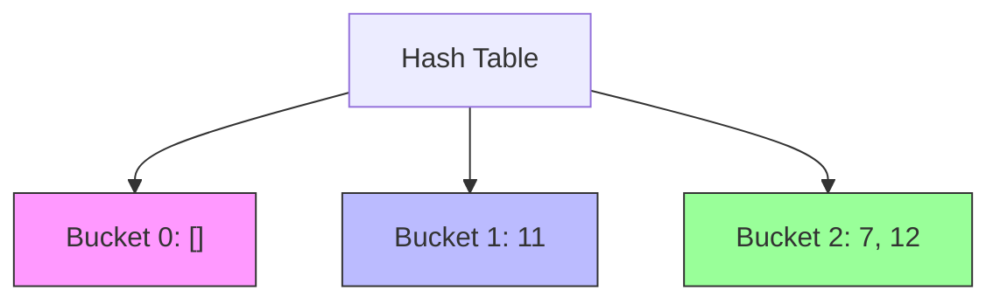
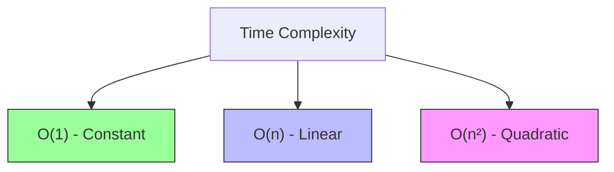
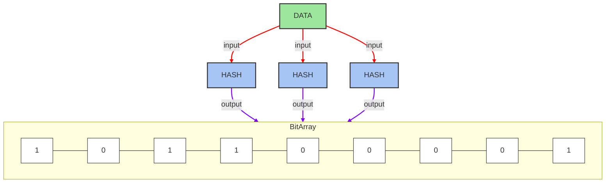

```mermaid
flowchart LR
    Head[Head] --> Node1
    Node1[Node A] --> Node2[Node B]
    Node2 --> Node3[Node C]
    Node3 --> Node4[Node D]
    Node4 --> Null[null]
    Tail[Tail] --> Node4
    
    Enqueue[Enqueue: O(1)]
    Dequeue[Dequeue: O(1)]
    
    Enqueue -.-> NewNode[New Node E]
    NewNode -.-> Null
    Node4 -.-> NewNode
    Tail -.-> NewNode
    
    Dequeue -.-> Node2
    
    %% Node styling
    classDef node fill:#A1E5AB,stroke:#333,stroke-width:2px,rx:10,ry:10
    classDef pointer fill:#FFD166,stroke:#333,stroke-width:2px
    classDef nullNode fill:#E9E9E9,stroke:#333,stroke-width:2px,rx:10,ry:10
    classDef operation fill:#118AB2,stroke:#333,stroke-width:2px,color:white,rx:5,ry:5
    classDef newNode fill:#FF7B9C,stroke:#333,stroke-width:2px,rx:10,ry:10
    
    class Node1,Node2,Node3,Node4 node
    class Head,Tail pointer
    class Null nullNode
    class Enqueue,Dequeue operation
    class NewNode newNode
```
