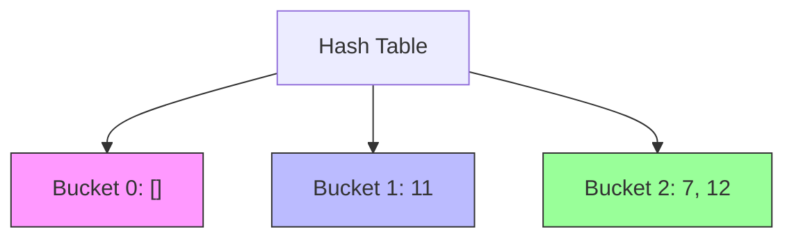
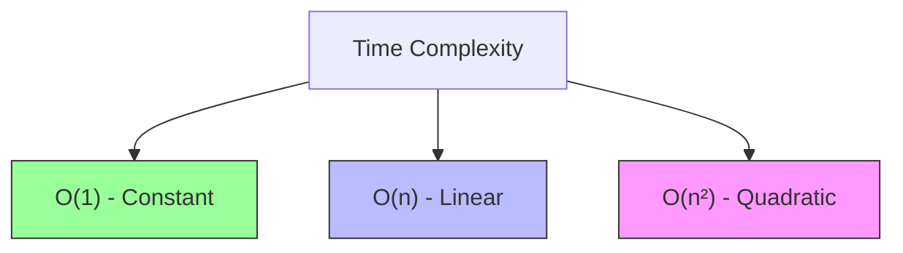
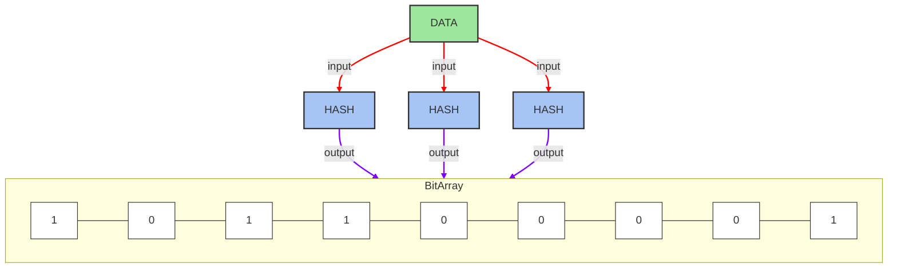

```mermaid
flowchart TD
    Start([Start]) --> Init[Initialize Head/Tail]
    Init --> Op{Operation?}
    
    Op -->|Insert| Insert[Create New Node]
    Insert --> UpdateTail[Update Tail.next]
    UpdateTail --> MoveTail[Move Tail Pointer]
    
    Op -->|Delete| Check{At Head?}
    Check -->|Yes| UpdateHead[Update Head Pointer]
    Check -->|No| FindPrev[Find Previous Node: O(n)]
    FindPrev --> Bypass[Bypass Deleted Node]
    
    UpdateHead & Bypass --> Free[Free Memory]
    MoveTail & Free --> Stop([Stop])
    
    style Start,Stop fill:#4CAF50,stroke:#333
    style Insert fill:#9f9,stroke:#333
    style UpdateHead,UpdateTail fill:#bbf,stroke:#333
    style FindPrev,Bypass fill:#ffcccb,stroke:#333
```
