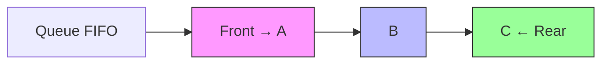
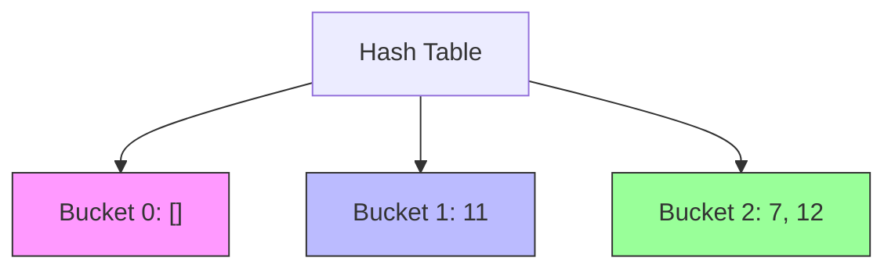

```mermaid
xychart-beta
    title "Time Complexity"
    x-axis "Input Size (n)" --> 1, 10, 100
    y-axis "Time (ms)" --> 1, 100, 10000
    line "O(1)" --> [(1,1), (10,1), (100,1)]
    line "O(n)" --> [(1,1), (10,10), (100,100)]
    line "O(n²)" --> [(1,1), (10,100), (100,10000)]
```
