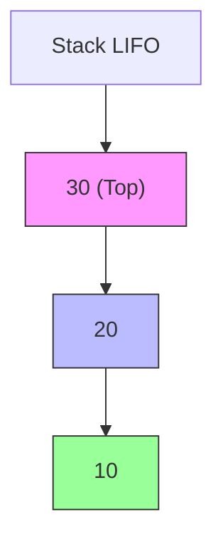

```mermaid
graph TD
    A[Stack LIFO] --> B["30 (Top)"]
    B --> C["20"]
    C --> D["10"]
    style B fill:#f9f,stroke:#333
    style C fill:#bbf,stroke:#333
    style D fill:#9f9,stroke:#333
```
